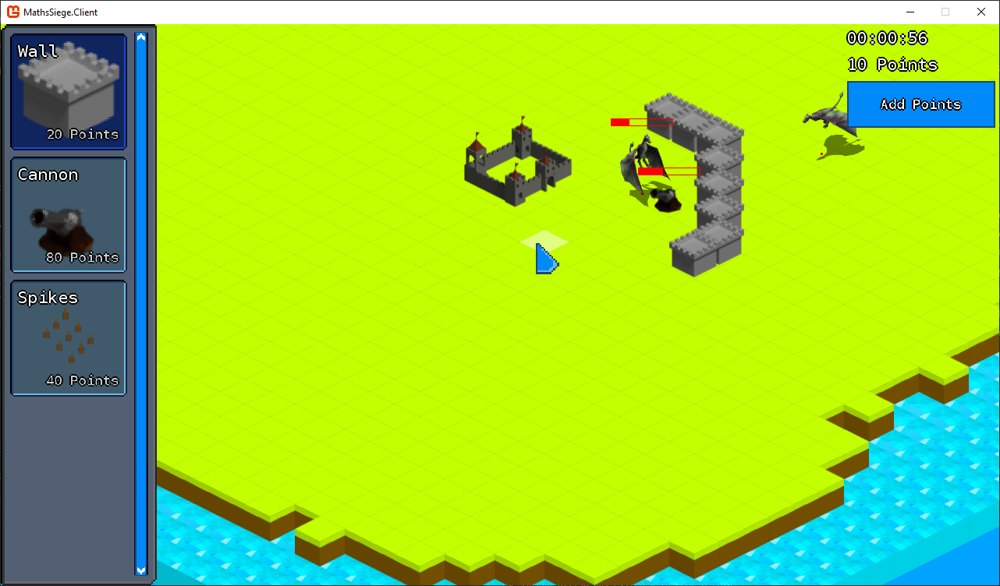

# MathsSiege



MathsSiege is an isometric RTS game that I made for my A level computer science
coursework. It's meant to be a somewhat educational game, with the idea that
you must answer questions to get points for placing defences.

There are two main components - a game client and a server. The server exposes
a REST api which the client can use to retrieve questions from a central database
and upload players' scores to the database. There is also an admin interface for
viewing and editing data.

## Building and running

### Prerequisites

- Server:
    - [.NET Core 2.2 SDK](https://dotnet.microsoft.com/download)
- Game Client:
    - [Visual Studio](https://visualstudio.microsoft.com/) (I've used 2017 and 2019)
    - [MonoGame SDK](http://monogame.net/downloads/)

### Running the server

```bash
cd MathsSiege.Server

# Install ef core tools
dotnet tool install --global dotnet-ef

# Initialise local db
dotnet ef database update

# Run server
dotnet run
```

The database is seeded with some dummy data on startup, if it is empty,
including a [default admin account](MathsSiege.Server/Data/DbSeeder.cs#L66).

### Running the game

Just open the solution in Visual Studio and run the `MathsSiege.Client` project.
You will need to have the server running and enter the url of the server in the
game settings the first time it's run.

## Assets

Sources for assets that I didn't create myself are listed below:

### Sprites

- https://opengameart.org/content/goblin
- https://opengameart.org/content/skeleton-warrior-0
- https://opengameart.org/content/wyvern-1

### Fonts

- https://www.fontspace.com/chequered-ink/gravedigger

### Audio

- https://soundimage.org/fantasywonder/fantascape_looping/
- https://freesound.org/people/lebaston100/sounds/192272/
- https://freesound.org/people/baefild/sounds/91293/
- https://freesound.org/people/GameAudio/sounds/220206/
- https://freesound.org/people/qubodup/sounds/184422/

### UI

- https://github.com/RonenNess/GeonBit.UI
